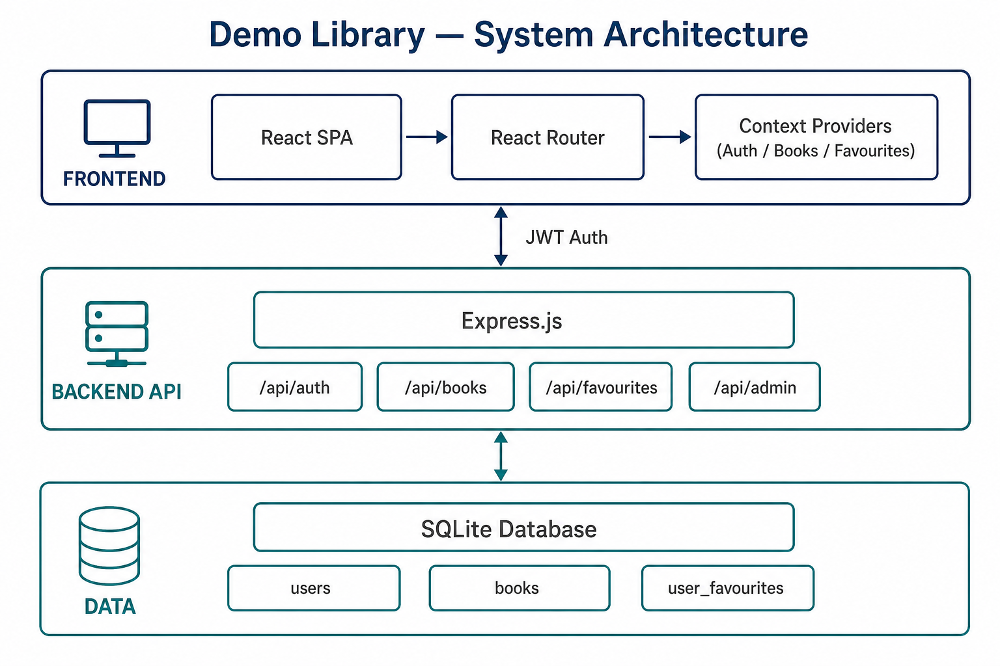
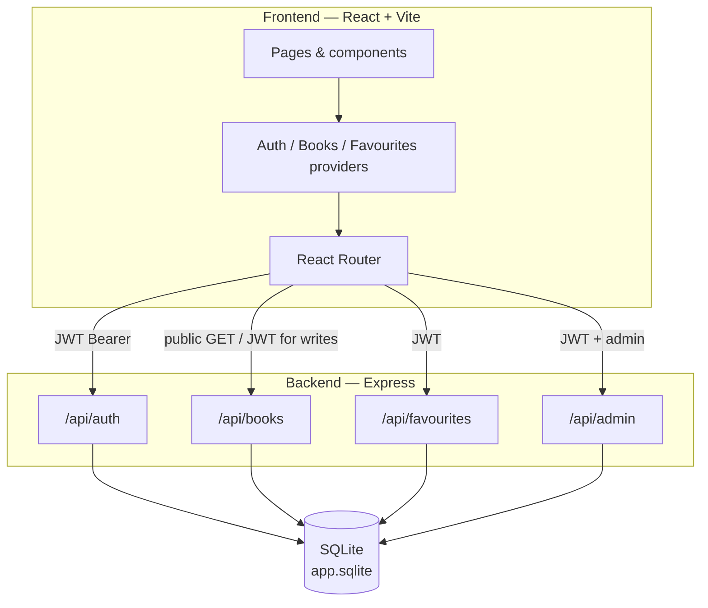
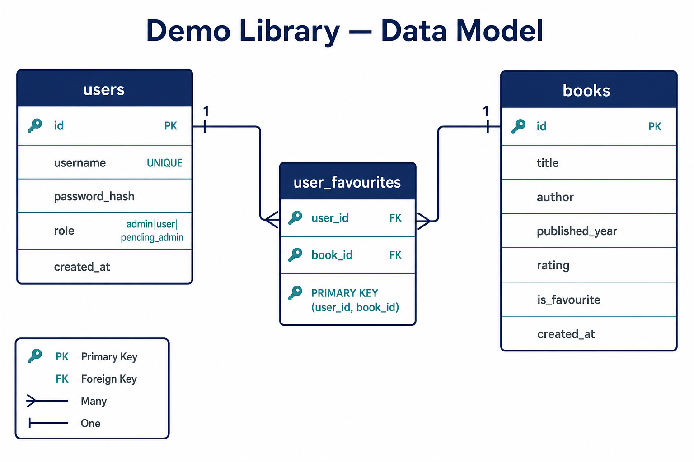
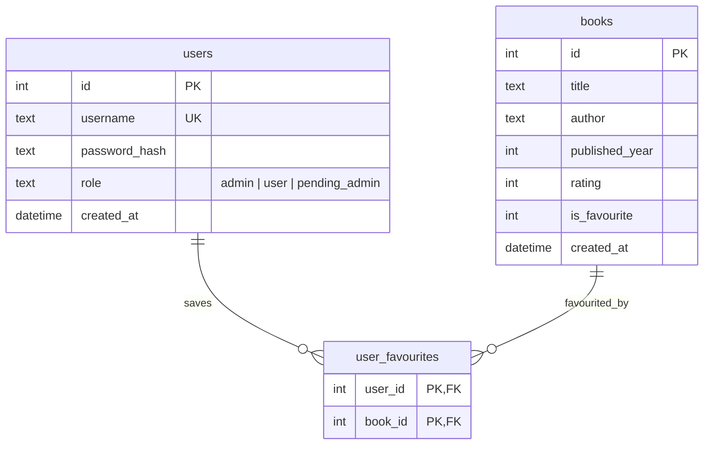
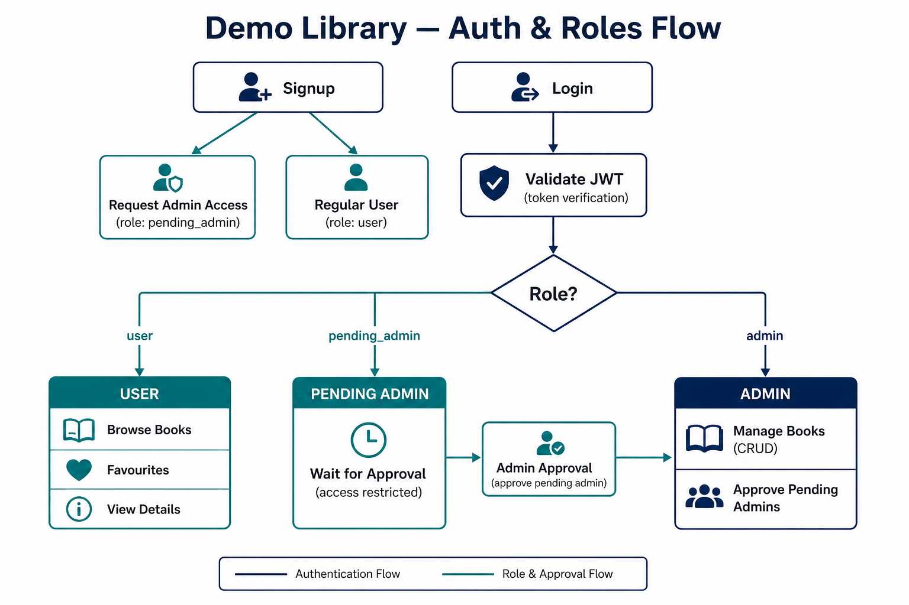
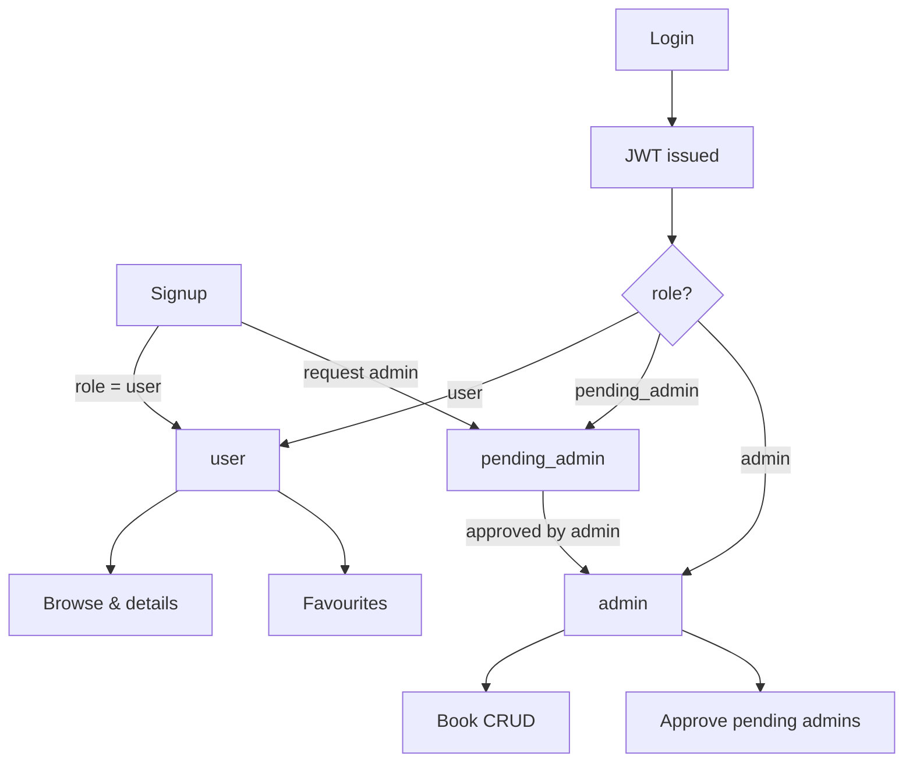
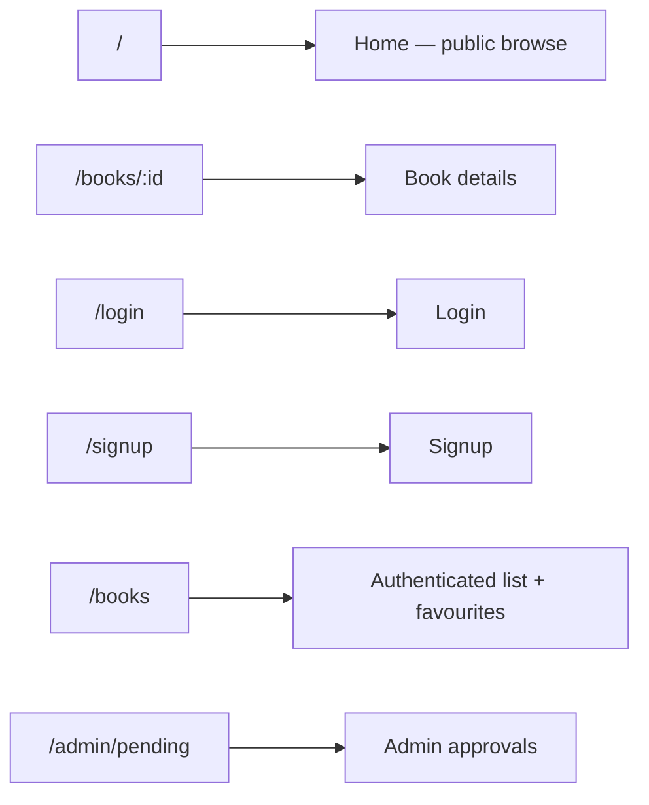

# Demo Library

A full-stack library web app for browsing books, saving favourites, and managing the catalogue with role-based admin access.

**Stack:** React + Vite · Node.js + Express · SQLite · JWT auth

---

## Preview


---

## Features

| Area | What you can do |
| --- | --- |
| Public browse | Open the home page without logging in; search, sort, filter by rating, paginate |
| Book details | Open any book by id |
| Auth | Sign up / log in with JWT stored in `localStorage` |
| Favourites | Signed-in users can star books and filter the list to favourites only |
| Admin catalogue | Admins create, update rating/fields, and delete books |
| Admin approvals | Users can request admin; existing admins approve pending accounts |

---

## System architecture

<p align="center">
  
</p>



**Layered backend:** `routes → controllers → services → repositories → SQLite`

---

## Data model

<p align="center">
  
</p>



---

## Auth & roles

<p align="center">
  
</p>



Default seeded admin (change after first login): `admin` / `admin123`

---

## API map

| Method | Path | Auth | Notes |
| --- | --- | --- | --- |
| `POST` | `/api/auth/signup` | — | Optional admin request → `pending_admin` |
| `POST` | `/api/auth/login` | — | Returns JWT |
| `GET` | `/api/books` | — | List books |
| `GET` | `/api/books/:id` | — | Book details |
| `POST` | `/api/books` | Admin | Create book |
| `PATCH` | `/api/books/:id` | Admin | Update fields |
| `DELETE` | `/api/books/:id` | Admin | Delete book |
| `GET` | `/api/favourites` | User | My favourites |
| `POST` | `/api/favourites/:bookId` | User | Add favourite |
| `DELETE` | `/api/favourites/:bookId` | User | Remove favourite |
| `GET` | `/api/admin/pending-admins` | Admin | List pending |
| `POST` | `/api/admin/pending-admins/:id/approve` | Admin | Approve |

---

## App routes (frontend)



---

## Project layout

```
demo-library/
├── frontend/          # React + Vite SPA
│   └── src/
│       ├── pages/     # Home, books, auth, admin
│       ├── components/
│       ├── context/   # Auth, books cache, favourites
│       └── api/
├── backend/           # Express API
│   ├── src/
│   │   ├── routes/
│   │   ├── controllers/
│   │   ├── services/
│   │   ├── repositories/
│   │   └── config/    # DB + auth
│   └── data/          # SQLite file
└── docs/figures/      # Architecture & model diagrams
```

---

## Quick start

```bash
# Backend
cd backend
npm install
npm run dev

# Frontend (separate terminal)
cd frontend
npm install
npm run dev
```

Optional: seed sample books with `npm run seed` in `backend/`.

---

## Figures index

| Figure | File |
| --- | --- |
| System architecture | [`docs/figures/architecture-overview.png`](docs/figures/architecture-overview.png) |
| Data model (ER) | [`docs/figures/data-model.png`](docs/figures/data-model.png) |
| Auth & roles flow | [`docs/figures/auth-roles-flow.png`](docs/figures/auth-roles-flow.png) |
